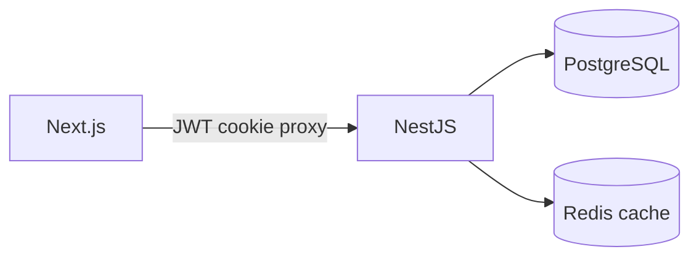

# Architecture

## Overview

Monorepo with clean architecture on the API, Next.js frontend, and shared utilities.

```
apps/api     — NestJS + TypeORM + PostgreSQL + Redis
apps/web     — Next.js 15 + shadcn/ui
packages/shared — country→currency map, permission constants
scripts/     — 10k employee seeder (COPY)
```

## Clean architecture (API)

Each feature module (`auth`, `employees`, `insights`, `roles`, `users`) separates:

- **domain** — entities and repository ports
- **application** — use cases (single `execute()`, complexity ≤ 5)
- **infrastructure** — TypeORM, Redis cache decorators
- **presentation** — controllers and DTOs

## Data flow



Insights reads are cached (5 min TTL) and invalidated on employee CUD.

## Migrations

TypeORM migrations in `apps/api/src/database/migrations/`. Never use `synchronize: true`.

## Auth

JWT (15m) in httpOnly cookie via Next.js `/api/auth/login` and `/api/proxy` routes. RBAC permission keys on every protected route.
